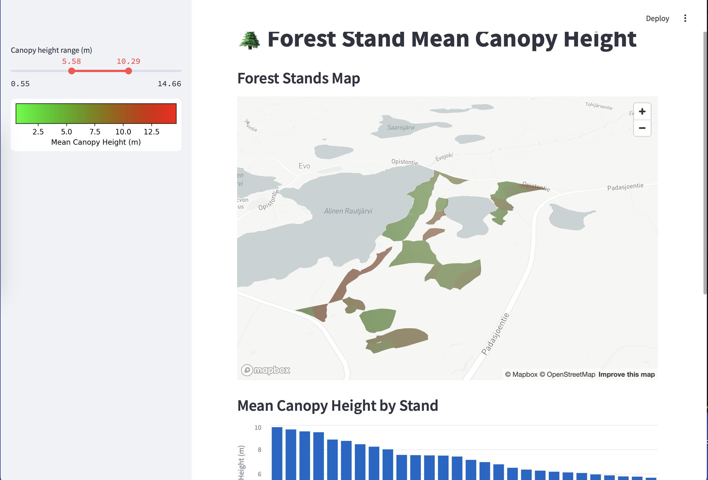

# geospatial-python

**Geospatial workflows in Python for forest canopy analysis**

---

## Table of Contents

1. [Overview](#overview)
2. [Prerequisites](#prerequisites)
3. [Data Preparation](#data-preparation)
   - [Forest Stands Shapefile](#forest-stands-shapefile)
   - [Bounding Box & Tile Selection](#bounding-box--tile-selection)
4. [Data Download](#data-download)
   - [Digital Surface Model (DSM)](#digital-surface-model-dsm)
5. [DTM Approximation](#dtm-approximation)
6. [Canopy Height Model (CHM)](#canopy-height-model-chm)
7. [Zonal Statistics](#zonal-statistics)
8. [Visualization](#visualization)
9. [Screenshot](#screenshot)
10. [References](#references)
11. [TODO](#todo)

---

## Overview

This project walks through:

- Reading a forest-stands shapefile.
- Determining its geographic extent in WGS84.
- Downloading a matching Copernicus DSM from AWS.
- Approximating a bare-earth DTM via morphological opening.
- Computing a Canopy Height Model (CHM) as **DSM − DTM**.
- Calculating per-stand statistics.
- Visualizing results interactively with Streamlit and Pydeck.

---

## Prerequisites

- Python 3.8+  
- GDAL command-line tools (`ogrinfo`, `gdaltransform`)  
- Install Python packages:
  ```bash
  pip install geopandas rasterio rasterstats scipy streamlit pydeck altair matplotlib
  ```

---

## Data Preparation

### Forest Stands Shapefile

1. Place the shapefile files (`.shp`, `.dbf`, `.shx`, `.prj`) in `data/`.
2. Source data on GitHub: [QGIS Training Data – Forestry](https://github.com/qgis/QGIS-Training-Data/tree/master/exercise_data/forestry)  
3. Inspect the metadata:
   ```bash
   ogrinfo data/forest_stands_2012.shp -so -al
   ```
   Notable output:
   ```
   Extent: (397018.06, 6785470.29) - (397991.03, 6786913.83)
   SRS: ETRS89 / UTM zone 35N (EPSG:3067)
   ```

### Bounding Box & Tile Selection

Convert UTM corners to WGS84:
```bash
echo "397018.064608 6785470.289047" \
  | gdaltransform -s_srs EPSG:3067 -t_srs EPSG:4326
# → 25.0843, 61.1901

echo "397991.030469 6786913.827006" \
  | gdaltransform -s_srs EPSG:3067 -t_srs EPSG:4326
# → 25.1016, 61.2033
```
Both lon ∈ [25,26), lat ∈ [61,62) → **Tile: N61E025**

---

## Data Download

### Digital Surface Model (DSM)

Download the Copernicus DSM (10 m COG):
```bash
mkdir -p data/raster
aws s3 cp --no-sign-request \
  s3://copernicus-dem-30m/Copernicus_DSM_COG_10_N61_00_E025_00_DEM/Copernicus_DSM_COG_10_N61_00_E025_00_DEM.tif \
  data/raster/N61E025_copernicus.tif
```

---

## Run the code

```python
python forest_stands_stats.py
```

---


## Summary of Steps

### DTM Approximation

Approximate bare-earth DTM using greyscale morphological opening:

```python
import rasterio
from scipy.ndimage import grey_opening

with rasterio.open("data/raster/N61E025_copernicus.tif") as src:
    dsm = src.read(1); meta = src.meta

dtm_approx = grey_opening(dsm, size=(15, 15))

with rasterio.open("data/raster/N61E025_dtm_approx.tif", "w", **meta) as dst:
    dst.write(dtm_approx, 1)
```

---

### Canopy Height Model (CHM)

Compute CHM = DSM − DTM and save:

```python
import numpy as np
import rasterio

with rasterio.open("data/raster/N61E025_copernicus.tif") as src:
    dsm = src.read(1); meta = src.meta

with rasterio.open("data/raster/N61E025_dtm_approx.tif") as src:
    dtm = src.read(1)

chm = dsm - dtm
meta.update(dtype="float32")

with rasterio.open("data/raster/N61E025_chm.tif", "w", **meta) as dst:
    dst.write(chm.astype("float32"), 1)
```

---

### Zonal Statistics

Compute per-stand metrics with `rasterstats`:

```python
import geopandas as gpd
from rasterstats import zonal_stats

stands = gpd.read_file("data/forest_stands_2012.shp").to_crs("EPSG:4326")

# Mean elevation
elev_stats = zonal_stats(stands.geometry, "data/raster/N61E025_copernicus.tif", stats=["mean"])
stands["mean_elev"] = [x["mean"] for x in elev_stats]

# Mean canopy height
chm_stats = zonal_stats(stands.geometry, "data/raster/N61E025_chm.tif", stats=["mean"])
stands["mean_canopy"] = [x["mean"] for x in chm_stats]

stands.to_file("data/forest_stands_with_stats.geojson", driver="GeoJSON")
```

---

## Visualization

Launch the Streamlit app:

```bash
streamlit run streamlit_app.py
```
[See it Live](https://danielrmeyer-geospatial-python-streamlit-app-2zdkqc.streamlit.app)
---

## Screenshot



---

## References

- [Copernicus DEM on AWS](https://registry.opendata.aws/copernicus-dem/)  
- [GDAL ogrinfo documentation](https://gdal.org/programs/ogrinfo.html)

---

## TODO

- Find way to determine accuracy of our bare earth approximation
- automate grabbing the DEM tile from copernicus given a shape file so tool can be used on any shape files
- Create a forest stand detail page which plots all canopy height data for that forest stand.
